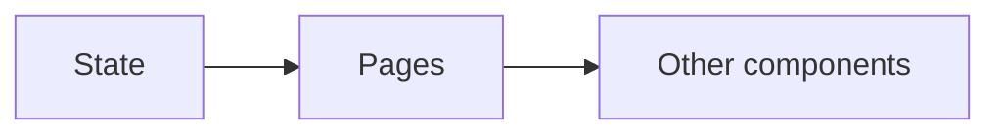

# Express Blog Admin Front-end

This is a part of an assignment from The Odin Project (top). The assignment was to build a backend API with two different front-ends, on for the end-user (blog reader) and one for the admin (the blog writer).

This specific repository is for the administrator front-end. Here are the repositories for the backend API and the end user front end:

- [Backend REST API](https://github.com/aslanhudajev/express-blog-api)
- [End user Front-end](https://github.com/aslanhudajev/express-blog-front)

## Built with

- Vite
- React
- Axios
- React Router
- TinyMCE
- ShadCN
- Tailwind
- ...and more

## Features

A React front-end built with ShadCN components. React Router is used for SPA path navigation. Tanstack Query is used to fetch data from the API and its states `isError`, `isLoading` and `data` are used to display loading components. Highly recommend using Tanstack Query.

This front-end only lets you read posts.

## State

My general way of managing state was very simple for this site.
The general idea was this:

So basically, all state is held in the `Page` components, and passed downward into each `Page`´s children.

No state management library was used. I only used `useState` and `useRef`.

## TinyMCE

TinyMCE is used as the Rich Text Editor. The flow of how the data is stored is very simple.
All the content data, coming from TinyMCE, come in the form of HTML. This HTML is stored in the content field of each post in the database.
When the time comes for the [End user Front-end](https://github.com/aslanhudajev/express-blog-front) to consume this data, `React HTML Parser` is used to safely inject the HTML data into each `Post` page.
